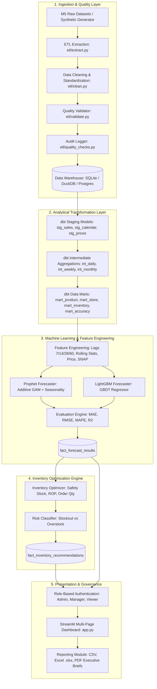

# Enterprise Architecture Documentation
## Retail Demand Forecasting & Inventory Optimization Platform

### 1. System Overview
The platform provides an end-to-end automated analytics solution designed to ingest raw Walmart M5 multi-store retail sales datasets, execute automated data cleaning and validation, run dbt analytical transformations, train machine learning time-series models (Prophet and LightGBM), optimize inventory replenishment buffers, and present interactive analytics to business decision makers through a role-protected Streamlit dashboard.

---

### 2. End-to-End Architectural Pipeline

---

### 3. Key Technology Stack
- **Data Engineering**: Python 3.10+, Pandas, DuckDB, SQLite, SQLAlchemy, PostgreSQL / Snowflake / BigQuery DDL.
- **Analytics Engineering**: dbt SQL transformations (Staging, Intermediate, Marts).
- **Machine Learning**: LightGBM (Gradient Boosted Trees), Facebook Prophet / Additive Seasonality GAMs, Scikit-Learn.
- **User Interface**: Streamlit with custom glassmorphic CSS, Plotly Interactive Charts.
- **Reporting & Security**: OpenPyXL, FPDF2, SHA-256 password hashing, Role-Based Access Control.
