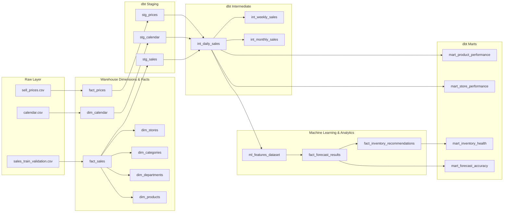

# Data Lineage & Transformation Guide
## Retail Demand Forecasting & Inventory Optimization Platform

### 1. Lineage DAG

---

### 2. Transformation Descriptions

| Model Name | Layer | Source | Granularity | Key Transformation Logic |
| :--- | :--- | :--- | :--- | :--- |
| **stg_sales** | Staging | `fact_sales` | Store-Item-Date | Type casting, negative sale zero-clipping |
| **stg_calendar** | Staging | `dim_calendar` | Date | Holiday indicator flag, is_weekend calculation |
| **stg_prices** | Staging | `fact_prices` | Store-Item-Week | Price validation, null handling |
| **int_daily_sales** | Intermediate | `stg_sales`, `stg_calendar`, `stg_prices` | Store-Item-Date | Joined daily revenue calculation ($units \times price$) |
| **int_weekly_sales** | Intermediate | `int_daily_sales` | Store-Item-Week | Weekly unit and revenue aggregations |
| **int_monthly_sales** | Intermediate | `int_daily_sales` | Store-Cat-Month | High-level monthly business velocity |
| **mart_product_performance** | Mart | `int_daily_sales` | Item | Lifetime product revenue, units, max daily spikes |
| **mart_store_performance** | Mart | `int_daily_sales`, `dim_stores` | Store | Store revenue rankings, regional category mix |
| **mart_inventory_health** | Mart | `fact_inventory_recommendations` | Store | Store-level stockout counts, total capital requirements |
| **mart_forecast_accuracy** | Mart | `fact_forecast_results` | Model-Horizon | MAE, RMSE, MAPE benchmark scorecard |
